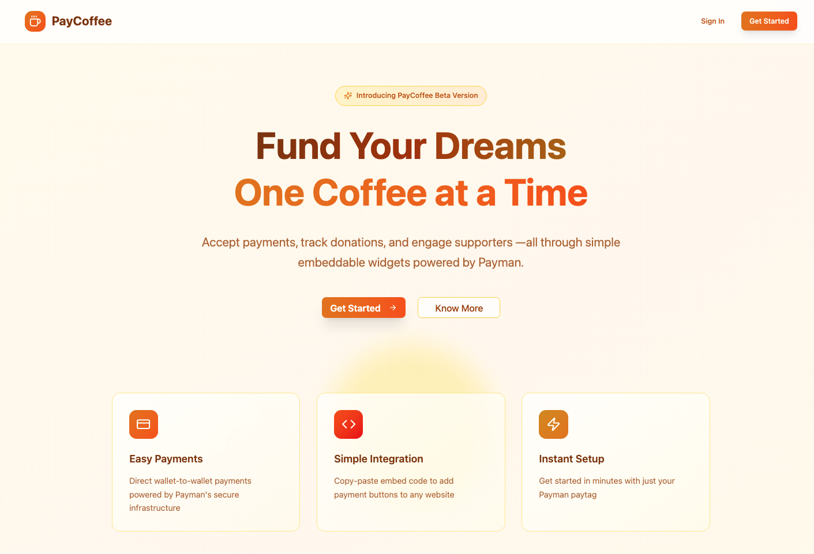

# PayCoffee ☕

**Fund Your Dreams, One Coffee at a Time**

PayCoffee is a modern payment widget platform that enables creators, developers, and businesses to accept donations and tips seamlessly through embeddable widgets powered by Payman's secure infrastructure.



### Mock Credentials

- **user-email**: companyA@example.com
- **user-password**: password

## 🌟 Features

### ✨ Easy Payment Widgets

- **One-Click Embedding**: Add payment widgets to any website with a single line of code
- **Customizable Design**: Match your brand with custom colors, amounts, and button text
- **Mobile Responsive**: Beautiful widgets that work perfectly on all devices

### 🔒 Secure Payments

- **Payman Integration**: Direct wallet-to-wallet payments using Payman's secure infrastructure
- **OAuth Authentication**: Secure supporter authentication through Payman's OAuth flow
- **Real-time Processing**: Instant payment processing with transaction tracking

### 🎨 Flexible Configuration

- **Preset Amounts**: Configure default donation amounts ($5, $10, $25, etc.)
- **Custom Amounts**: Allow supporters to enter any amount they choose
- **Personalization**: Add supporter names and messages to payments
- **Brand Matching**: Customize colors and text to match your brand

### 📊 Dashboard Management

- **Widget Management**: Create, edit, and delete payment widgets
- **Transaction History**: Track all payments and supporter messages
- **Analytics**: Monitor your earnings and supporter engagement
- **Embed Code Generation**: Get ready-to-use embed codes instantly

## 🚀 Quick Start

### For Widget Creators

1. **Sign Up**: Create your PayCoffee account at [paycoffee.vercel.app](https://paycoffee.vercel.app)
2. **Connect Payman**: Link your crypto wallet to receive payments
3. **Create Widget**: Configure your payment widget with custom amounts and styling
4. **Embed**: Copy the one-line embed code and paste it into your website
5. **Start Earning**: Begin accepting payments from your supporters immediately

### For Supporters

1. **Click Widget**: Click the floating coffee button on any website
2. **Choose Amount**: Select a preset amount or enter a custom amount
3. **Add Message**: Optionally add your name and a supportive message
4. **Connect Payman**: Authenticate securely with your Payman account
5. **Send Payment**: Complete the payment with one click

## 💻 Technical Stack

- **Frontend**: React 19 + Vite + TailwindCSS
- **Backend**: Node.js + Express + Supabase
- **Authentication**: JWT + Payman OAuth
- **Payments**: Payman API integration
- **Database**: PostgreSQL (via Supabase)
- **Deployment**: Vercel (Frontend) + Render (Backend)

## 🔧 Integration

Add PayCoffee to your website with just one line:

```html
<script
  src="https://paycoffee.onrender.com/api/embed/widget.js?id=YOUR_WIDGET_ID"
  defer
></script>
```

The widget automatically appears as a floating button in the bottom-right corner of your site.

## 🛡️ Security

- **End-to-End Security**: All payments processed through Payman's secure infrastructure
- **No Sensitive Data Storage**: PayCoffee never stores payment credentials
- **OAuth Protection**: Secure authentication flow for all transactions
- **HTTPS Everywhere**: All communications encrypted and secure

## 🌐 Demo

Visit our [live demo](https://paycoffee.vercel.app) to see PayCoffee in action and create your first widget.

## 📞 Support

- **Documentation**: Visit our docs for detailed integration guides
- **Issues**: Report bugs or request features via GitHub Issues
- **Community**: Join our Discord for community support and updates

## 🤝 Contributing

We welcome contributions! Please see our contributing guidelines for details on how to submit pull requests, report issues, and suggest improvements.

## 📝 License

MIT License - see LICENSE file for details.

---

**Built with ❤️ by Hrishikesh**

_Powered by Payman • Secure payments made simple_
